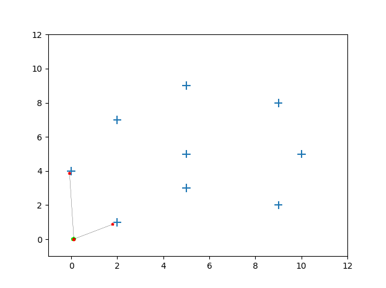

## FastSLAM 1.0 - landmark/ feature based map representation

__Assumtion:__ Known data association  

Rao-Blackwellization  
1. Robot pose approximated by samples/ particles and particle filter is used for localization
2. Each particle is associated with a set of EKF state estimators corresponding to observed landmarks estimating the map
